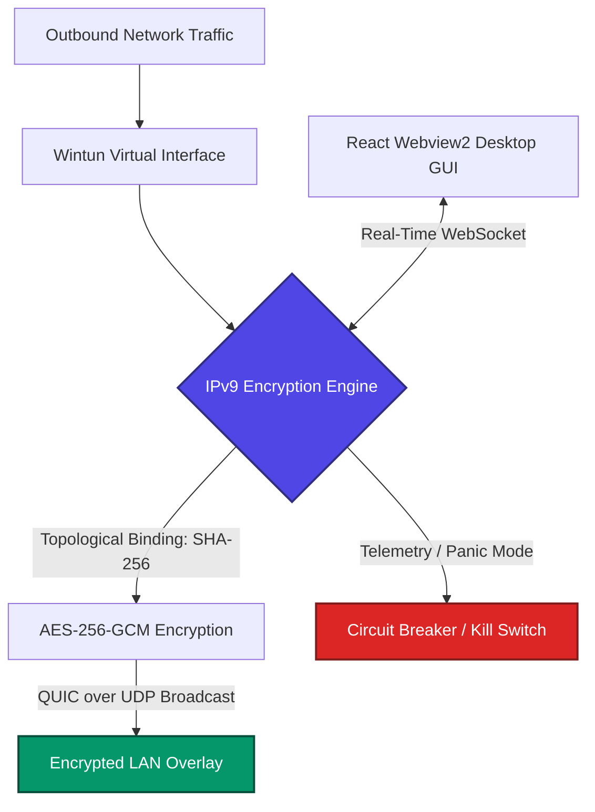

# IPv9 Shield — Central Router v3.0

> **"the privacity is free"**

**IPv9 Shield** is a next-generation, Zero-Trust LAN overlay network router designed to deliver absolute privacy, firewall evasion, and local network isolation. By combining high-performance system-level networking with advanced cryptographic binding, it establishes an encrypted **Secure Overlay Network** directly on your workstation.

---

## How It Works

IPv9 Shield secures your network at the system layer by spawning a high-performance virtual network interface (Wintun). 

1. **Traffic Capture**: The application intercepts outgoing IP packets and redirects them through a local tunnel.
2. **Topological Binding**: Rather than using static keys, the cryptographic keys are mathematically tied to your machine's physical hardware topology (local IP + physical router gateway) using a SHA-256 hash.
3. **Encrypted Transport**: Packs IP payloads into encrypted QUIC over UDP datagrams.
4. **Local Network Safety**: Uses an intelligent broadcast-subnetwork scheme to prevent network poisoning or firewall blocking, ensuring compatibility across all router environments.

---

## Key Features

- **Unbreakable Cryptographic Anchoring**
  Military-grade AES-256-GCM encryption dynamically combined with local hardware topology parameters. If intercepted, it cannot be decrypted outside the physical environment.
- **DPI and Firewall Evasion**
  Encapsulates standard TCP/IP traffic into accelerated QUIC datagrams, rendering Deep Packet Inspection (DPI) by ISPs or corporate firewalls completely ineffective.
- **Automated LAN Topology Scanner**
  Actively scans local network segments on boot (ARP reads, multi-threaded ping sweeps, local DNS mapping) to dynamic-bind endpoints and show real-time diagnostics.
- **Anti-Leak Circuit Breaker (Panic Mode)**
  A zero-latency local kill-switch. If the network buffers are corrupted or suffer anomaly patterns, the shield immediately drops traffic to prevent any unencrypted leakage.
- **Premium Holographic Dashboard**
  Built as a zero-terminal Windows-native desktop application with a futuristic glassmorphism React interface, active status animations, traffic graphs, and real-time scanning feedback.

---

## Tech Stack

- **Core Engine & Network Bridge**: Go (Golang) using Windows API Wintun bindings.
- **Protocol & Cryptography**: Rust (ipv9_rust_forge) for high-speed cryptographic operations.
- **Frontend App**: React (TypeScript, custom UI design, high-frequency WebSockets telemetry).
- **Desktop Wrapper**: Windows Webview2 (runs as a standalone, double-click application without terminal windows).
- **Deployment**: Custom Inno Setup wrapper for single-click desktop deployment.

---

## Important Warnings Before Starting

- **Temporary Internet Disruption**: Upon launching IPv9 Shield, your physical network adapter may temporarily disconnect or drop active connections while the system binds to the topological routing tables and spawns the virtual Wintun interface.
- **Antivirus / Firewall Interference**: Because IPv9 Shield captures traffic at the system level and uses UDP broadcast for evasion, some aggressive antivirus software may flag the executable. You may need to add it to your exclusions list.
- **Do not mix with other VPNs**: Running IPv9 Shield concurrently with other VPN clients (like OpenVPN or WireGuard) can cause routing loops or immediate network failure.

---

## Proof of Concept / How to Test it Works

1. **Launch Wireshark**: Open Wireshark and listen to your main physical network adapter (e.g., Wi-Fi or Ethernet).
2. **Start IPv9 Shield**: Let the application perform the deep scan and secure the connection.
3. **Analyze the Packets**: You will notice that standard TCP traffic (like HTTP/HTTPS) vanishes. Instead, Wireshark will only display rapid **UDP Broadcast (255.255.255.255)** packets.
4. **Conclusion**: Your ISP or local router can no longer see the destination IPs or the content of your browsing, only encrypted UDP noise.

---

## Getting Started

### Prerequisites Before Installation
- **Windows 10 / 11 (64-bit)**
- **Administrator Privileges**: Required to create the virtual Wintun network interface during installation and operation.
- **WebView2 Runtime**: Used for the native desktop dashboard (usually pre-installed on Windows 11, might require manual installation on older Windows 10 versions).
- **Inno Setup 6 (For Developers Only)**: Required if you intend to compile the `.iss` installer script from source. *Note: When using Inno Setup IDE, please select **Build -> Compile** instead of "Run (F9)" to avoid debugger mismatch errors.*

### Installation
1. Download the latest installer IPv9_Shield_Installer.exe from the Releases section.
2. Run the installer (it will handle background configuration, closing conflicting applications, and registering the system bridge).
3. Open IPv9 Shield from your desktop or start menu. The system will start in silent mode, boot the visual dashboard, and perform the deep LAN scan before securing your connection.

---

## License and Copyright

**Copyright © S40. All rights reserved.**

The community and users are encouraged to study, modify, and build upon this project to advance network privacy research. However, all core intellectual property, protocols, and designs belong to the original author S40.

---

*the privacity is free*
